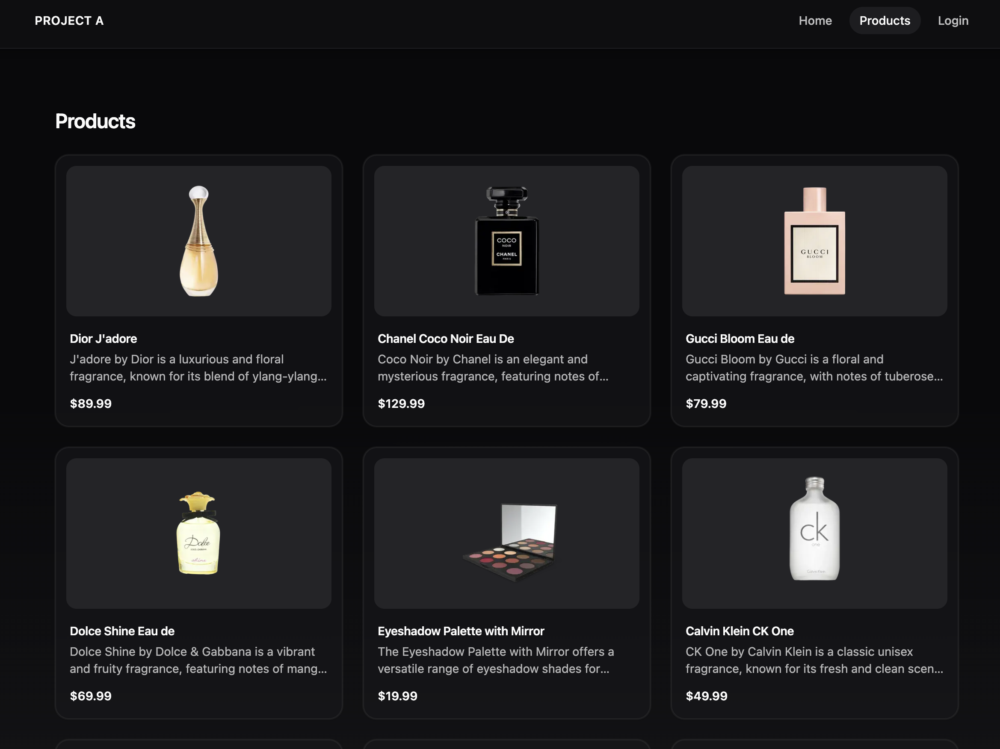
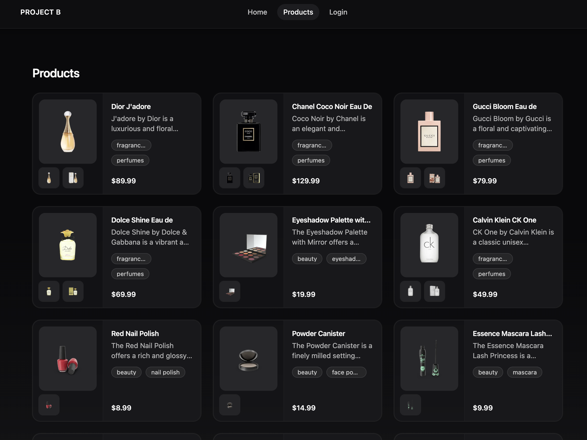

# Monorepo Market – Senior Frontend Assessment

This project demonstrates a scalable, brand-driven product portal built with **Next.js 16**, **React 19**, and **Turborepo**.

The application supports multiple brands (**ProjectA** and **ProjectB**) and multiple markets (`/en`, `/ca`) using a shared, strongly-typed component architecture.

The primary goals of this implementation are:

- Avoid code duplication (strict DRY principle)
- Support brand-specific markup, styling, and business logic
- Demonstrate SSR, ISG, Partial Pre-Rendering (PPR), and caching
- Showcase a testing strategy (unit + integration)
- Maintain strong type safety and modular structure

## Visual Overview

### ProjectA – Products Page



### ProjectB – Products Page



---

## Architecture Overview

The project is structured as a Turborepo monorepo to enable shared logic, reusable components, and clear separation of concerns.

### Applications

- `apps/ProjectA` – Brand A application
- `apps/ProjectB` – Brand B application

Each application:

- Supports `/en` and `/ca` markets
- Uses brand-specific configuration
- Is independently buildable and deployable

### Shared Packages

- `@repo/ui` – Shared React component library
- `@repo/utils` – Shared utility functions (routing helpers, validation, shuffling, logging)
- `@repo/constants` – Global configuration and brand definitions
- `@repo/types` – Centralized type definitions
- `@repo/tailwind-config` – Shared Tailwind configuration
- `@repo/eslint-config` – Shared ESLint rules
- `@repo/typescript-config` – Shared TypeScript configuration

### Brand Configuration Strategy

Brand customization is handled through strongly typed configuration objects defined in `@repo/constants`.

Each brand provides a declarative configuration layer that controls:

- Layout structure (e.g., vertical vs horizontal `ProductCard`)
- Visual and alignment differences
- Component behavior variations
- Feature toggles (e.g., reviews visibility, tag display, gallery thumbnail count)

This configuration layer effectively acts as a lightweight feature-flag system, enabling per-brand customization without introducing conditional branching inside applications.

All shared components remain generic and consume only typed configuration, ensuring scalability, strict DRY adherence, and predictable behavior across brands.

## Shared Component Architecture

A core requirement of this assessment was the ability to customize markup, styles, and business logic per brand while keeping components reusable and DRY.

To achieve this, shared components are designed as **config-driven, generic building blocks**.

### Example: `ProductCard`

`ProductCard` is implemented once inside `@repo/ui` and receives a configuration object:

```ts
type IProductCardConfig = {
  layout: "vertical" | "horizontal";
  titlePlacement: "top-left" | "bottom-left";
  contentAlign: "left" | "center";
  showCategories: boolean;
  thumbnails: number;
};
```

### Brand Configuration Example

Each brand provides its own configuration:

#### ProjectA

- Vertical layout
- Title bottom-left
- No category tags
- No thumbnails

#### ProjectB

- Horizontal layout
- Title top-left
- Category tags enabled
- Two thumbnails

The component dynamically adjusts:

- Layout structure
- Rendered elements
- Conditional sections
- Behavior

Without duplicating markup across projects.

---

### Why This Approach?

Instead of creating separate components per brand:

- No `ProductCardA`
- No `ProductCardB`
- No conditional branching inside applications

All customization is controlled through typed configuration passed from the brand layer.

This ensures:

- Single source of truth
- Minimal duplication
- Strong type safety
- Easy scalability for additional brands

## Rendering Strategy (Next.js 16)

The application demonstrates multiple rendering strategies available in Next.js 16.

### Server-Side Rendering (SSR)

Dynamic routes such as:

- `/[market]/product/[slug]`
- `/[market]/login`

use server components and runtime data access (e.g., `cookies()`).

Authentication state is resolved on the server to ensure:

- Correct SEO behavior
- Proper gating of extended product information
- No client-side flashing of protected content

---

### Incremental Static Generation (ISG)

The `/[market]/products` route uses Next.js 16 caching with `cacheLife()`.

A 5-minute revalidation window is configured to ensure that:

- Crawlers receive updated HTML
- Users see periodically refreshed product data
- The page remains performant while allowing controlled content mutation

This approach combines caching efficiency with predictable regeneration behavior.

---

### Content Mutation Mechanism

To demonstrate incremental updates, the product list applies a deterministic shuffle to the first 10 items using a seeded algorithm.

This:

- Produces modified content per revalidation window
- Avoids non-deterministic `Math.random()`
- Ensures consistent output within the cache window

A console log is emitted to demonstrate regeneration events.

---

### Partial Pre-Rendering (PPR)

Next.js Partial Pre-Rendering is leveraged to:

- Deliver static shells instantly
- Stream dynamic content when necessary
- Improve performance without sacrificing dynamic behavior

This allows hybrid rendering behavior across routes.

## Authentication & SEO Handling

A simple cookie-based authentication mechanism is implemented.

Authentication state is resolved on the server using `cookies()` to ensure:

- No client-side hydration flicker
- Proper SEO behavior
- Correct content gating

For simplicity, a refresh-token mechanism is not implemented in this demo.  
In a production environment, access tokens would be short-lived and refreshed securely using a rotation strategy (e.g., rotating refresh tokens with server-side validation).

### Logged-out State

- `/[market]/products` remains publicly accessible
- `/[market]/product/[slug]` shows limited product information
- Extended product details are hidden

### Logged-in State

When authenticated:

- Extended product details are rendered server-side
- Additional product metadata and reviews become visible

This ensures public content remains crawlable while sensitive information is server-gated.

## Testing Strategy

The project includes both unit and integration tests to demonstrate testing approach and architectural validation.

### Unit Tests

Unit tests focus on shared components and utility logic inside `@repo/ui` and `@repo/utils`.

Examples include:

- `ProductCard` layout rendering (vertical vs horizontal)
- Conditional rendering (tags, thumbnails, title placement)
- `ProductGallery` behavior
- `ProductReviews` rendering logic
- Utility functions (`isLocale`, `isNumericId`, `shuffleFirstN`, etc..)
- Header active link logic

These tests validate core functionality and configuration-driven behavior.

---

### Brand-Specific Rendering Tests

Integration-style tests verify that:

- ProjectA renders `ProductCard` in vertical layout
- ProjectB renders `ProductCard` in horizontal layout
- Brand configuration is correctly applied

This ensures that shared components adapt properly per brand.

---

### Authentication Flow Tests

Tests cover:

- Logged-in vs logged-out rendering
- Conditional visibility of extended product details
- Header behavior based on authentication state

The goal is not full coverage, but to demonstrate architectural correctness and critical flow validation.

## How to Run the Project

### Prerequisites

- **Node.js 22 LTS (recommended)** — used during development
- Node.js ≥ 18
- npm ≥ 9

> Note: Using Node 23 may show `EBADENGINE` warnings from some dependencies (e.g. Jest / ESLint ecosystem). The project still runs, but Node 22 LTS is the smoothest setup.

---

### Install Dependencies

From the repository root:

```bash
npm install
```

### Run Both Applications (Monorepo)

```bash
npm run dev
```

### Run Specific Application (Monorepo)

```bash
npm run dev:a
npm run dev:b
```

This starts:

- **ProjectA**
- **ProjectB**

Each application runs independently and supports:

- `/en`
- `/ca`

### Build the Applications (Monorepo)

```bash
npm run build
```

### Build specific Application (Monorepo)

```bash
npm run build:a
npm run build:b
```

### Run Tests

```bash
npm run test
```

### Watch mode:

```bash
npm run test:watch
```

### Testing Caching & ISR Behavior

To properly observe caching, ISR, and Partial Pre-Rendering behavior, the project must be run in production mode.

Development mode (`next dev`) bypasses several caching mechanisms — this is expected behavior in Next.js.

#### 1. Build from the repository root:

```bash
npm run build
```

#### 2. Start a specific application in production mode:

```bash
cd apps/ProjectA
npm start
```

or

```bash
cd apps/ProjectB
npm start
```

This ensures:

- `cacheLife()` is respected
- Revalidation intervals are applied
- Deterministic product shuffling occurs once per revalidation window

Cache durations are defined in the shared configuration layer.

Available cache profiles:

- `products30s` – Short interval for testing regeneration
- `products5m` – 5-minute revalidation (default for product lists)
- `product5m` – 5-minute revalidation for product details

Cache entries expire after 1 hour (expire) and won’t be served beyond that window

These values can be adjusted centrally without modifying route logic.

**Note on regeneration behavior (stale-while-revalidate):**  
When `stale > 0`, the first request after a `revalidate` window may be served from the previous cached result while regeneration happens in the background. A subsequent request will receive the freshly regenerated content. This is expected behavior and keeps responses fast.

### Lint & Type Check

```bash
npm run lint
npm run check-types
```

## Architecture Decisions & Trade-offs

### Configuration-Driven UI vs Component Duplication

A configuration-driven approach was chosen over creating brand-specific components.

This avoids:

- Component duplication (`ProductCardA`, `ProductCardB`)
- Application-level branching
- Diverging implementations per brand

Trade-off:
Component props are slightly more complex, but scalability and maintainability are significantly improved.

---

### Server-First Rendering Strategy

Server Components are used by default to:

- Minimize client JavaScript
- Improve SEO
- Avoid hydration inconsistencies

Client Components are introduced only where necessary (navigation hooks, interactivity).

Trade-off:
Requires clear separation between server and client concerns.

---

### Controlled Content Mutation with ISR

The products page uses incremental revalidation with deterministic shuffling.

This ensures:

- Predictable regeneration
- Stable cache windows
- SEO-friendly static output

Trade-off:
True real-time updates are not implemented in this demo.

---

### Authentication Scope

Routes are not fully protected in this demo.

Only extended product details are gated via HttpOnly session cookies.

If write operations (cart, checkout, reviews) were introduced, session validation and authorization would be enforced inside Server Actions.

Trade-off:
This keeps the demo focused on rendering and architecture rather than full auth infrastructure.

---

### Monorepo Scalability

Turborepo enables:

- Shared packages
- Independent app builds
- Clean separation between brand and shared layers

This structure supports horizontal scaling to additional brands with minimal duplication.

## Potential Improvements (Production Considerations)

In a real production environment, the following enhancements would be introduced:

- **Internationalization (i18n)**  
  Integration with a dedicated translation layer (e.g., `next-intl`) to support scalable multilingual content instead of static market-based strings.

- **Pagination / Infinite Scroll**  
  Server-driven pagination for large product datasets to improve performance, memory usage, and scalability.

- **Robust Authentication**  
  Token-based authentication with proper session validation and authorization checks for protected mutations (cart, checkout, reviews).

- **Stronger Validation**  
  Schema-based validation (Zod) is applied at the server boundary for form inputs (login) to ensure runtime safety alongside TypeScript typing.  
  In a production environment, external API responses would also be validated at the integration boundary.
